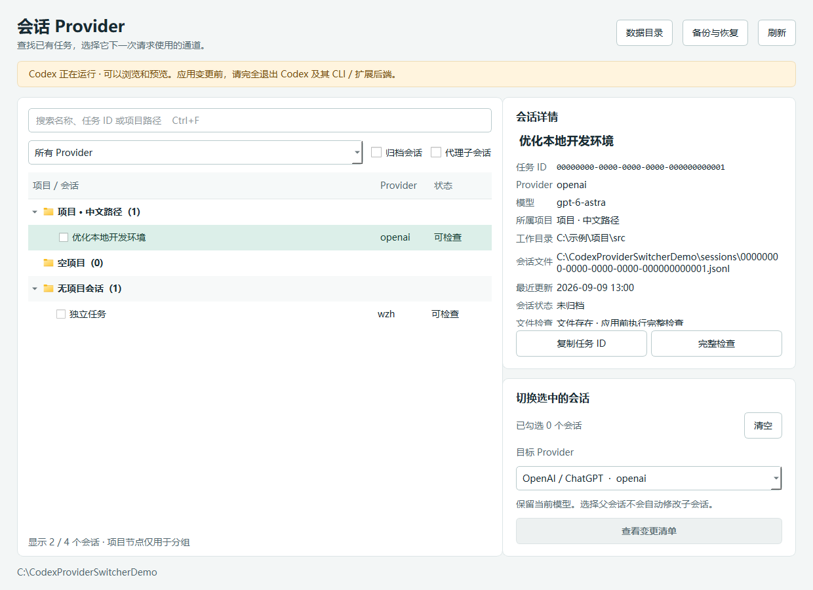

<p align="center">
  
</p>

<h1 align="center">Codex Provider Switcher</h1>

<p align="center">
  Windows 上的 Codex 会话 Provider 浏览、批量切换、备份与恢复工具。
</p>

<p align="center">
  
  
  
  
</p>

> [!WARNING]
> 本工具会修改本地 Codex 会话元数据。应用切换或恢复前，必须完全退出 Codex / ChatGPT、Codex CLI，以及编辑器中的 Codex 后端。首次使用建议选择可丢弃的测试会话。



## 为什么需要它

Codex 可以在配置中定义多个 model provider，但已有会话通常会保留创建时使用的 Provider。本工具用于查找本地会话并离线调整这一字段，同时保持模型、聊天正文、项目归属和全局默认配置不变。

它是独立的社区工具，不是 OpenAI 或 Codex 官方产品，也不使用官方会话修改 API。

## 功能

- 按“项目 → 会话”浏览本地记录，支持名称、任务 ID 和工作目录搜索。
- 显示归档会话与代理子会话，并支持单个或批量选择。
- 从 `config.toml` 读取 Provider，保留已移除 Provider 作为可迁出的当前值。
- 应用前预览变更，并完整校验会话文件、数据库记录和历史索引。
- 每次操作自动建立文件与 SQLite 一致性备份。
- 支持中断检测、自动回滚和按操作恢复。
- GUI 与 CLI 共用同一套校验及写入逻辑。
- 支持中文、长路径、扩展盘符路径和 UNC 路径显示。

## 下载与安装

普通用户建议从 GitHub Releases 下载发布压缩包，而不是下载 Source code。发布包应至少包含：

```text
CodexProviderSwitcher.exe   图形界面
codex-provider.exe          命令行工具
install-shortcut.ps1        桌面快捷方式安装脚本
app-icon.ico                快捷方式图标
使用说明.md
验收报告.md
THIRD_PARTY_NOTICES.md
licenses/                   第三方许可证文本
```

解压到固定目录后运行 `CodexProviderSwitcher.exe`。创建桌面快捷方式可在 PowerShell 中执行：

```powershell
pwsh -NoProfile -File .\install-shortcut.ps1
```

程序无需管理员权限。当前发布产物未进行代码签名时，Windows SmartScreen 可能显示“未知发布者”；建议在 Release 中同时提供 SHA-256 校验值。

## 基本使用

1. 启动 GUI，确认顶部显示的数据目录正确。
2. 搜索并勾选需要修改的会话；单击会话标题只会查看详情。
3. 选择目标 Provider，点击“查看变更清单”。
4. 完全退出所有可能访问 Codex 数据文件的程序和后端。
5. 在变更清单中点击“应用变更”。
6. 重新打开 Codex，确认历史可读，并通过目标服务的请求记录验证实际通道。

快捷键：`Ctrl+F` 搜索、`F5` 刷新、会话树中 `Ctrl+C` 复制任务 ID、空格勾选。

> [!NOTE]
> 本地字段修改成功不代表目标 Provider 一定支持当前模型、认证有效或请求已经到达目标服务。

## Provider 与数据范围

目标列表读取所选数据目录 `config.toml` 中的 `[model_providers.*]`，并包含内置 `openai`。工具只修改选中会话的 Provider，模型字段保持原值。

默认数据目录为环境变量 `CODEX_HOME`；未设置时使用 `%USERPROFILE%\.codex`。也可以通过 GUI 的“数据目录”按钮或 CLI 的 `--codex-home` 指定其他目录。

当前版本仅支持 Windows 本地会话，并要求会话文件位于所选数据目录内。遇到下列情况时，整批操作会停止：

- Codex 或相关后端仍在运行；
- 会话文件缺失；
- 任务 ID 或 Provider 在文件与数据库之间不一致；
- 数据库索引结构未知或历史偏移越界；
- 预览后文件或配置发生变化。

工具不读取 Token 文件，不显示认证内容，也不会自动结束进程、重启 Codex、发送消息或发起测试请求。

## 备份与恢复

每次切换会在以下位置生成操作目录：

```text
<CODEX_HOME>\provider-switcher\operations\<操作 ID>\
  manifest.json
  state_5.sqlite
  thread_history_1.sqlite
  <任务 ID>.before.jsonl
  <任务 ID>.after.jsonl
```

GUI 的“备份与恢复”页面或 CLI 的 `operations`、`restore` 命令可以查看并恢复操作。恢复也要求 Codex 完全退出。

备份包含原会话历史，可能含敏感内容。不要上传操作目录、数据库或会话 JSONL 到 Issue、PR、网盘或公开仓库。

## 命令行

以下示例在发布目录中执行：

```powershell
.\codex-provider.exe list --search '关键词'
.\codex-provider.exe list --include-archived --include-agents --json
.\codex-provider.exe show --thread-id '<任务 ID>' --json
.\codex-provider.exe switch --thread-id '<任务 ID>' --to-provider custom --dry-run
.\codex-provider.exe switch --thread-id '<任务 ID 1>' --thread-id '<任务 ID 2>' --to-provider custom --apply
.\codex-provider.exe operations --json
.\codex-provider.exe restore --operation-id '<操作 ID>'
.\codex-provider.exe --codex-home 'D:\CodexData' list --json
```

`switch` 必须明确选择 `--dry-run` 或 `--apply`。成功退出码为 `0`，运行失败为 `1`，参数错误为 `2`。

## 从源码运行

建议使用标准 CPython 3.12。Anaconda 等环境中的 Qt DLL 可能与 PySide6 冲突，因此推荐使用独立虚拟环境。

```powershell
git clone https://github.com/EwwwzhI/codex-provider-switcher.git
cd codex-provider-switcher

uv python install 3.12
uv venv .venv --python 3.12 --managed-python
uv pip install --python .venv\Scripts\python.exe -r requirements.txt

.\.venv\Scripts\python.exe gui_main.py
.\.venv\Scripts\python.exe cli_main.py list
```

## 测试与构建

所有自动化测试都使用运行时生成的隔离合成数据，不读取或修改真实 `CODEX_HOME`。

```powershell
.\.venv\Scripts\python.exe -m pytest -q
pwsh -NoProfile -File .\build.ps1 -Python .\.venv\Scripts\python.exe
```

构建脚本会运行全部测试、生成单文件 GUI/CLI EXE，并执行打包后的 CLI JSON 与 GUI 启动冒烟测试。详细验收范围见 [VALIDATION.md](VALIDATION.md)。

## 项目结构

| 路径 | 说明 |
| --- | --- |
| `provider_switcher/core.py` | 会话扫描、校验、切换、备份、回滚与恢复 |
| `provider_switcher/gui.py` | PySide6 图形界面 |
| `provider_switcher/cli.py` | 命令行入口与 JSON 输出 |
| `provider_switcher/assets/` | PNG 主图与多分辨率 ICO |
| `tests/` | 核心逻辑、故障注入与 GUI 回归测试 |
| `tools/` | 合成数据、图标与许可证收集工具 |
| `build.ps1` | 测试、PyInstaller 构建及产物冒烟测试 |
| `install-shortcut.ps1` | 创建或刷新桌面快捷方式 |

## 隐私与安全

- 仓库不应包含任何真实 `.codex` 数据、会话 JSONL、SQLite 数据库、备份或认证文件。
- 提交 Issue 时请使用 `tools/create_demo.py` 生成的合成数据复现问题。
- 报告安全问题时不要附带真实聊天内容、Token、Provider URL 或个人路径。
- `.gitignore` 已覆盖常见 Codex 数据文件，但提交前仍应运行敏感信息扫描并检查 `git diff --cached`。

## 兼容性与限制

本工具基于本地 `state_5.sqlite`、`thread_history_1.sqlite` 和会话 JSONL 的已知结构实现。Codex 更新后若结构发生变化，工具应停止写入，而不是猜测新结构。请在升级 Codex 或本工具后先用测试会话验证。

## 贡献

欢迎提交 Issue 和 Pull Request。建议包含：

- 清晰的复现步骤和预期行为；
- 使用合成数据得到的日志或截图；
- 对应的自动化测试；
- 不改变 Provider 之外会话内容的说明。

## 许可证与第三方组件

本项目源代码采用 [MIT License](LICENSE)。你可以使用、复制、修改、合并、发布和分发本项目，但必须保留原版权与许可声明。

PySide6、Qt、PyInstaller 和 Python 等第三方组件采用各自许可证，详情见 [THIRD_PARTY_NOTICES.md](THIRD_PARTY_NOTICES.md)。GitHub Release 应保留构建产物中的 `licenses/` 目录。
